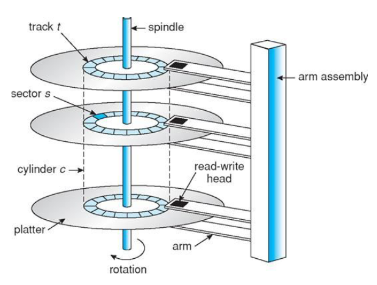
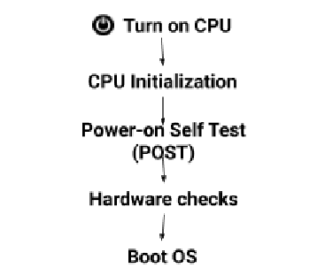
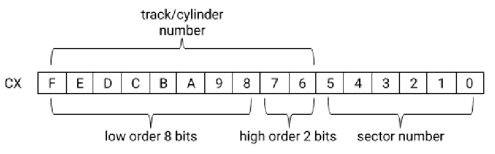
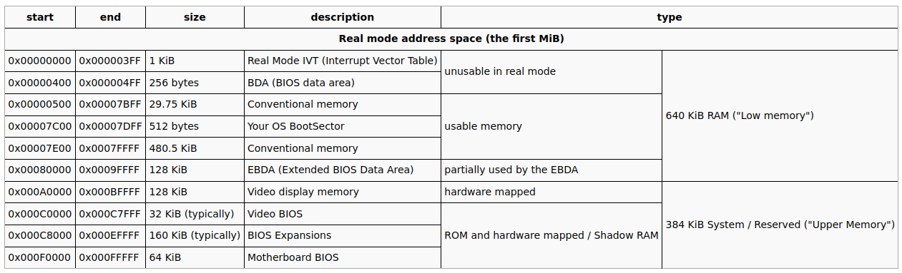
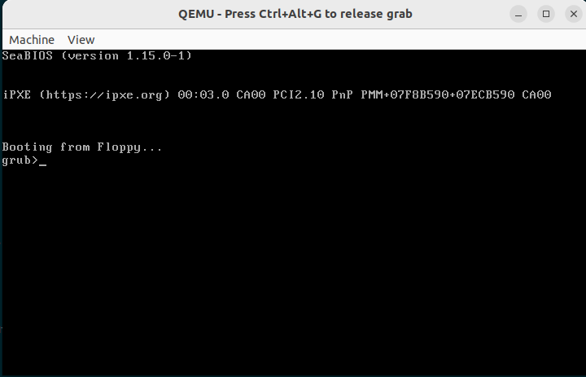
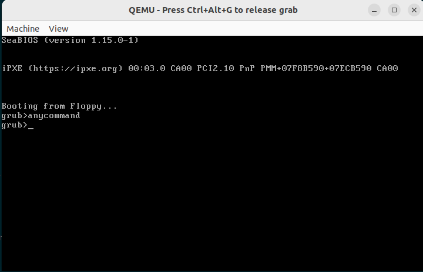
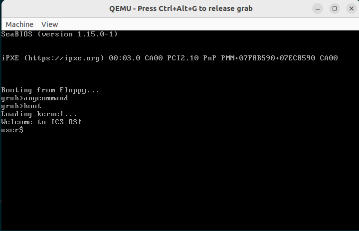
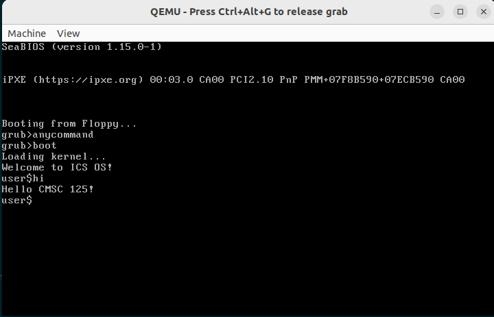

---
title: "Understanding the PC Boot Process and Writing a Bootloader"
author: [AJ Hao]
date: "\\today"
subject: "Processes"
header-left: "CMSC 125 | Operating Systems (Laboratory)"
header-center: ""
header-right: "The PC Boot Process"
footer-left: "Revision: \\today "
footer-center: "\\thepage"
footer-right: "\\theauthor | ICS-UPLB"
titlepage: true
...


# UNDERSTANDING THE PC BOOT PROCESS AND WRITING A BOOTLOADER

### Learning Outcomes
At the end of this laboratory session, the students should be able to:

1. change settings in the BIOS setup utility
2. explain the boot process of a BIOS-based PC; and
3. write a simple bootloader for a BIOS-based PC.

## Content

1. [Required Packages](#required-packages)
2. [BIOS Setup Utility](#BIOS-setup-utility)
3. [PC Boot Sequence](#pc-boot-sequence)
4. [Writing a Bootloader](#writing-a-bootloader)
   - [Bootloaders](#bootloaders)
   - [Emulators](#emulators)
   - [BIOS Interrupts](#bios-interrupts)
   - [x86 Real Mode Segmented Memory Model](#x86-real-mode-segmented-memory-model)


## Required Packages
1. Ubuntu 20.04
2. qemu
3. nasm
4. build-essential

```bash
$ sudo apt update ; sudo apt install build-essential gcc-multilib qemu qemu-system-i386 nasm dosfstools -y 
```

## BIOS Setup Utility
It is important to understand how control is transferred to the operating system from the hardware. The Personal Computer (PC) is preloaded with a piece of software (called  firmware ) to manage hardware-level or low-level operations that start the process. Traditionally, the Basic Input/Output System (BIOS) is the standard firmware. This firmware provides “basic” device drivers that interact with device controllers for devices such as display and keyboard. Due to BIOS’ age and limitations, modern PC’s now use the Unified Extensible Firmware Interface (UEFI) firmware. It can still however emulate BIOS. This lab will focus on the boot process of BIOS-based/emulated PCs to simplify the lab. However, students are encouraged to read [3][4] for discussions on UEFI.

Settings like detected devices and peripherals, time and date settings, boot device priority, etc. can be viewed and set in the setup utility. This can be accessed by pressing ** F2** o r ** Del** , depending on the vendor, right after powering on the PC. The key may need to be pressed successively so as not to be skipped during bootup.


## PC Boot Sequence

1. Find the BIOS startup program . Once the PC is turned on, the CPU and registers will reset to a specific value (the value varies based on the hardware). It will then look at a pre-programmed location for the start of the BIOS boot program. This is normally located at  `FFFF0h` ( `0xFFFF0` ), right at the end of the system memory and usually just contains a "`JMP`" instruction telling the processor where to go to find the real BIOS startup program[9]. 
2. Perform a Power-on Self Test . The system will then conduct a Power-on Self Test (POST) which checks if the RAM, disk drives, devices, and other required hardware are present and okay. 
3. Check other hardware components . It will then check the existence of the other hardware such as the keyboard, external hard disks, video cards, mouse, etc. 
4. Read the boot sector of a boot device. The BIOS will attempt to read the boot sector (usually the first sector,  Figure 1 ) of the set boot device (can be hard disk, optical disk, or flash drive). 
5. Copy the bootloader into the memory .  If successful, the boot sector (which is the bootloader itself) will be copied to the memory location `7C00h` (`0x7C00`). A “`JMP`” instruction to 7C00h will be executed to transfer control to the bootloader. 
6. Transfer control to the OS kernel . Finally, the bootloader will transfer control to the operating system kernel. The boot process is now completed as summarized in  Figure 2 .

    

    


## Bootloader 
The main function of the bootloader is to load the operating system, the kernel in particular. In linux, the **Linux Loader (LILO)** and the **GRand Unified Bootloader (GRUB )** are the popular bootloaders that load the linux kernel. Advanced bootloaders such as GRUB have multiple stages located in other parts of the disk to support more sophisticated features.

## Writing a Bootloader 
Bootloaders are usually written in assembly language to minimize space since there is a limit in its size. The following rules must be observed: 
 
1. The bootloader  must  be `512` bytes long, the size of a disk sector. 
2. It  must end (the last two bytes) with the bootloader signature ‘`AA55`’ (`0xAA55`). Without the signature the BIOS will not recognize this as the bootable disk. 
 
## Emulators 
In this lab, the  Quick Emulator (QEMU)  [6] will be used to test the bootloader. QEMU can be considered as hardware implemented in software. It is similar to VirtualBox which was used in the first lab. QEMU can support different processor architectures such as i386, arm, mips, ppc, etc.. Start the emulator as shown below.  

 ```bash
$ qemu-system-i386 #start qemu using Intel i386, observe that it searches for possible boot devices  
 ```

 
## BIOS interrupts  
In writing the bootloader, BIOS interrupts are used since there is still no OS running. The bootloader will execute in the 8086 Real Mode[7][10]. Below are two BIOS interrupts that you need to use. See the Source Code section for examples on how these services are used[8].


1. **INT 0x10** - Service 0x0E - Display a character.

    All the display related calls are made through this interrupt.

    | Register | Description |
    | -----------------------: | :------------------------------------------------------ |
    | AH| 0x0E |
    | AL| ASCII code of the character to be displayed |
    | BH| Page number (for most of our work this is 0x00) |
    | BL| Text attribute (for most of our work this is 0x07) |
  

2. **INT 0x13**  - Service 0x02 - Read Disk Sectors

    This interrupt will be used for reading the kernel sector from the boot device. If the boot device is a floppy disk, Track/cylinder number and Head number are set to zero (0). 

    | Register | Description |
    | -------- | ----------- |
    | AH | 0x02 |
    | AL | Number of sectors to be read (1-128) |
    | CH | Track/cylinder number (0-1023) |
    | CL | Sector number (1-17) |  
    | DH | Head number (0-15) |  
    | DL | Drive number (0=A;, 1=2nd floppy, 80h=drive 0, 81h=drive 1) |  
    | ES:BX | Memory location to store the sector/s read |  

    After the call the following are the register values,

    | Register | Description |
    | -------- | ----------- |
    | AH | Status |
    | AL | Number of sectors read |
    | CF | 0 if successful, 1 if error |


**Reminders on using  INT 0x13**:
 
1. BIOS disk reads should be retried at least three times and the controller should be reset when error is  detected 
2. Be sure ES:BX does not cross a 64K segment boundary or a DMA error will occur.
3. Only the disk number is checked for validity 
4. The parameters in CX change depending on the number of cylinders will be read. The track/cylinder number is a 10-bit value taken from the 2 high order bits of CL and the 8 bits in CH (low order 8 bits of track): 



## x86 Real Mode Segmented Memory Model
Modern operating systems running on Intel processors run in Protected Mode. However, during the boot up, 
the processor operates in Real Mode. Understanding memory access in Real Mode is important to write a 
boot loader.[13] 

The read disk sector of the BIOS interrupt 0x13 above requires that the `ES:BX` should be set. This should point to the memory location(a pointer in C) where the contents of the disk sector being read should be placed in the physical memory.

Physical addresses in x86 real mode are 20 bits, 2^20 gives 1MB (from 0x00000 to 0xFFFFF). x86 real mode uses segmentation by default, thus virtual addresses use base/segment:offset. Dedicated registers are used for specifc segments like CS(Code Segment), DS(Data Segment), SS(Stack Segment), and ES(Extra Segment). The base is 16 bits and the offset is 16 bits. 

To convert the virtual/segmented address to physical address, the segment is shifted left four bits and added to the offset to get the physical address.  

Since the size of the offset is 16 bits, the size of a segment is max 2^16 which is 64KB. An important thing to remember is that a segment should start at a 'paragraph' boundary which is a physical address that is evenly divisible by 0x10.

You cannot just place the sector being read anywhere in the memory since some areas are reserved. The memory map of x86 in real mode is shown below. Memory ranges labeled "Conventional memory" can be used as destination for the sectors to read. 





# Learning Experiences

Before writing the bootloader, first let us create a bootable MS-DOS disk image and examine its  boot sector.

```bash
$mkfs.msdos -C myfloppy.img 1440        #create an MS-DOS floppy disk 
$ls -lh                                 #observe the size 
$file myfloppy.img                      #examine the file type of the image 
$fdisk -l myfloppy.img                  #examine the disk structure 
$hexdump -n 512 myfloppy.img            #dump the first 512 bytes, look for  0xaa55 
$hexdump -n 512 -c myfloppy.img         #dump the first 512 bytes with readable characters,  
                                        #take note of the strings 

$objdump -Mintel -D -b binary -mi386 -Maddr16,data16 myfloppy.img   #disassemble bootsector to see the obj code 
$qemu-system-i386 -fda myfloppy.img -boot a                         #attach the floppy and set it as the boot device then boot

#if you are using Codespaces, use --nographic option
$qemu-system-i386 -fda myfloppy.img -boot a --nographic           #attach the floppy and set it as the boot device then boot
```

What was the output in qemu? Let us now assemble  nothing.asm  (see Source Code section) and replace the boot sector of the floppy with the generated binary. The dd command below “inserts” bootsector.bin to myfloppy.img.


```bash
$nasm -o bootsector.bin nothing.asm     #create the boot sector binary 
$ls -lh                                 #observe that the size is 512 bytes 
$dd if=bootsector.bin of=myfloppy.img bs=512 count=1 conv=notrunc   #write the bootsector 
$hexdump -n 512 myfloppy.img            #dump the first 512 bytes, look for  0xaa55 
$hexdump -n 512 -c myfloppy.img         #dump the first 512 bytes with readable characters 
$objdump -Mintel -D -b binary -mi386 -Maddr16,data16 myfloppy.img   #disassemble the bootsector 
$qemu-system-i386 -fda myfloppy.img -boot a                         #attach the floppy and set it as the boot device

#if you are using Codespaces, use --nographic option
$qemu-system-i386 -fda myfloppy.img -boot a --nographic           #attach the floppy and set it as the boot device then boot

```
What did you observe? Now try the steps above for  character.asm  and  string.asm  and observe the results.

## Assesment Tool

You are given a partially working assembly code for the (1)  bootloader and a fully working assembly code for the (2) kernel. 
You are expected to “fill in” the missing lines of codes to make bootloader work. 
 
Create a bootloader that does the following: 

1. Prompts the user to enter a command (like a shell prompt e.g `user@hostname$`). 
2. Once the user inputs the  boot  command, the kernel will be loaded. However, if the user inputs any command other than the boot command, the shell prompt (e.g. `user@hostname$`) will just have to be printed once more. 
3. Shell prompt (or command prompt) should be of the initials@cmsc125-section. 
EXAMPLE: `jeiencinas@cmsc125-e3l` 
4. You will need to edit the assembly code for the  bootloader  (`bootsect.asm`) ONLY. The kernel (`kernel.asm`) and `routines.asm` remain as they are.

### Sample Output










# References

1. CMSC 125 Handout, A.Y. 2015-2016
2. http://www.pcguide.com/ref/mbsys/bios/bootSequence-c.html
3. https://www.howtogeek.com/56958htg-explains-how-uefi-will-replace-the-bios/
4. https://www.happyassassin.net/2014/01/25/uefi-boot-how-does-that-actually-work-then/
5. http://www.bioscentral.com/misc/biosbasics.htm
6. https://www.qemu.org/
7. https://wiki.osdev.org/Real_Mode
8. https://wiki.osdev.org/BIOS
9. https://wiki.osdev.org/System_Initialization_(x86)
10. https://wiki.osdev.org/Memory_Map_(x86)
11. https://thestarman.pcministry.com/asm/debug/Segments.html
12. https://wiki.osdev.org/My_Bootloader_Does_Not_Work
13. http://www.c-jump.com/CIS77/ASM/Memory/lecture.html


## Acknowledgment

This material builds on top of the contributions by former CMSC 125 instructors: Joman Encinas, Chris Templado, Betel de Robles, Zenith Arnejo, Berna Pelaez 


## License

This document is licensed under [CC BY-SA 4.0](https://creativecommons.org/licenses/by-sa/4.0/)

